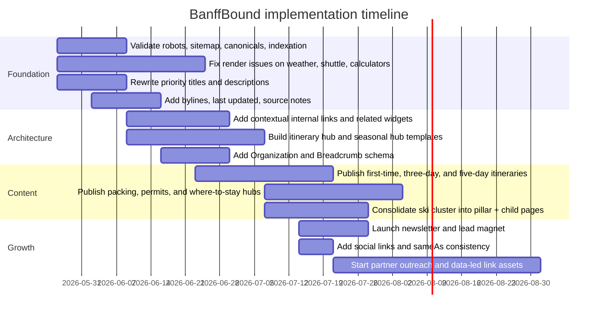

# BanffBound SEO and Growth Audit

## Executive Summary

BanffBound already has the bones of a strong search product. The site presents a broad, traveler-friendly information architecture with clear top-level buckets for **Things To Do**, **Plan Your Trip**, **Safety**, and **Where To Stay**; it also shows a meaningful mix of evergreen planning pages and utility-style pages such as a **Park Pass Guide**, **Calgary to Banff**, **Camping Guide**, **Weather Guide**, **Parking Predictor**, **Shuttle Reservations**, **Ski Pass Calculator**, **Wildlife Tracker**, and niche audience guides like **Car-Free Banff**, **Family Guide**, and **Dog-Friendly Banff**. Many inspected URLs use short, clean slugs and clear visible H1s, which is a solid foundation. citeturn1view0turn35view0turn35view1turn35view2turn10view4turn35view3turn35view4turn11view1turn35view7turn35view8turn35view9

The biggest gap is that BanffBound is currently stronger as a **collection of useful pages** than as the **definitive planning ecosystem** for Banff. Compared with Banff & Lake Louise Tourism, Parks Canada, and The Banff Blog, it is missing or under-expressing several of the features that make a site the default planning destination: a deep itinerary framework, stronger seasonal and trip-length content, more visible trust signals, richer contextual internal linking, a visible subscriber/distribution engine, and a clearer off-site brand footprint. Banff & Lake Louise Tourism prominently surfaces multi-day itineraries, a Moraine Lake travel guide, accommodation discovery, a trip builder, newsletter signup, media/influencer resources, and travel partners; Parks Canada exposes trail conditions, bulletins, planning, camping, passes, contact information, social channels, and its mobile app; The Banff Blog pairs itineraries and planning content with a newsletter, travel map, social channels, and deeper editorial scale. citeturn23view0turn26view6turn27view1turn27view2turn27view3turn28view0turn28view2turn28view3turn28view4turn29view0turn29view3turn29view4turn29view5

The highest-priority SEO issue is not a classic “missing keywords” problem. It is a **query-coverage and rendering problem**. BanffBound covers many useful subjects, but several of its strongest pages are not packaged around the exact search intents that dominate travel planning, and some JS-driven tools render incomplete or weak default states in crawl output. In the rendered audit output, the weather page shows “Loading…” placeholders, the shuttle page shows an empty countdown, and the ski calculator shows a nonsensical default “Best Option $0,” which strongly suggests that part of the site’s user value is being deferred to client-side rendering. At the same time, Google’s documentation continues to stress mobile parity, visible rendered content, strong title/meta parity, and working structured data. citeturn10view4turn35view4turn11view1turn44view0turn44view2turn44view4turn20view1

If the goal is to make BanffBound the go-to Banff planning resource, the fastest route is a three-part strategy: first, **fix rendering and strengthen indexable page quality**; second, **build a destination-planning content system** around itineraries, seasonal planning, transport, accommodations, maps, permits, and safety; third, **build authority and repeat reach** through a visible newsletter, social distribution, partner pages, and a stronger entity layer using Organization schema, bylines, editorial transparency, and if eligible, Google Business Profile. Google’s own documentation supports this direction: distinct descriptive titles, unique meta descriptions, strong canonicalization signals, crawlable sitemaps, visible mobile parity, and maintainable JSON-LD schema are all part of the baseline. citeturn45view5turn46view3turn43view0turn47view3turn44view0turn48view0turn50view0turn50view2

### Priority Snapshot

| Initiative | Why it matters | Effort | Impact | Quick win |
|---|---|---:|---:|---:|
| Rewrite titles and descriptions on top planning pages | Stronger alignment with how users actually search; better CTR potential | Low | High | Yes |
| Consolidate overlapping ski content into a single pillar + subpages | Reduces cannibalization risk and clarifies topic authority | Medium | High | Yes |
| Add itinerary hub and trip-length content system | Biggest gap vs. major Banff competitors | Medium | High | Yes |
| Improve server-rendering / hydration on JS tools | Protects crawlability, UX, and performance | High | High | No |
| Add author bios, last updated dates, sourcing notes | Improves trust and perceived reliability for planning content | Low | High | Yes |
| Launch newsletter + social links + lead magnets | Builds returning audience and distribution beyond Google | Medium | High | Yes |
| Build contextual internal links and related modules | Improves discovery, crawling, and conversion paths | Medium | High | Yes |
| Validate raw technical SEO | Canonicals, robots, sitemap, schema, and tracking need explicit verification | Medium | High | No |

## Audit Scope and Current Site Inventory

This audit is based on a front-end crawl of BanffBound’s public navigation and the pages that could be rendered in the browsing environment. The homepage exposes a broad destination-planning taxonomy: **Things To Do** with subtopics like Hiking, Interactive Trail Map, Lakes, Eat & Drink, Skiing & Snowboarding, Scenic Drives, Paddling, Biking, Via Ferrata, Wildlife Watching, Wellness & Spas, Arts & Culture, Shopping, Events & Festivals, and Tours & Experiences; **Plan Your Trip** with Park Pass Guide, Getting Here, Weather by Month, Trip Cost Calculator, Packing List, Camping Guide, Parking Predictor, Quiet Trails Finder, Shuttle Reservations, Icefields Parkway, Ski Pass Calculator, and more; **Safety** with Wildlife Encounters, Bear Spray Guide, Wildlife Tracker Map, Wildlife Calendar, Solo Hiker Safety, Altitude Sickness, Air Quality & Smoke, and an Emergency SOS Card; and **Where To Stay** with hotels, rentals, area pages, and type pages. citeturn1view0turn10view4turn11view1

Across the inspected URLs, the site appears to favor **flat, short URL paths** rather than deep nested folders: `/park-pass`, `/calgary-to-banff`, `/camping`, `/hiking`, `/monthly-weather`, `/parking`, `/shuttle-reservations`, `/ski-pass-calculator`, `/canmore-vs-banff`, `/car-free-banff`, `/family-guide`, `/dog-friendly`, `/wildlife-safety`, `/bear-spray`, `/wildlife-tracker`, and `/air-quality`. That is good for readability and maintenance, but it also means the site currently leans on internal links and content relationships rather than folder hierarchy to communicate topical clusters. citeturn35view0turn35view1turn35view2turn9view0turn10view4turn35view3turn35view4turn11view1turn35view6turn35view7turn35view8turn35view9turn11view8turn11view9turn12view0turn12view4

The homepage also shows important commercial and planning hooks: **Build Your Trip**, **Explore Banff**, **Upcoming Events**, **Browse Tours**, **Find Hotels**, and **Get Your Park Pass**. It links to footer-level planning nodes such as **Trip Builder**, **Hotels & Stays**, **Summer Guide**, **Winter Guide**, **News & Events**, **About**, **Contact**, and **Editorial Policy**. That is directionally excellent, because it signals BanffBound wants to be more than a blog. The opportunity is to make those hubs deeper, more indexable, and more visible across the site. citeturn40view0turn40view2

A representative content inventory from the accessible crawl is below.

| Section | Observed URLs |
|---|---|
| Core planning | Home, Park Pass, Calgary to Banff, Camping, Weather by Month, Shuttle Reservations, Ski Pass Calculator, Parking Predictor |
| Activities | Hiking, Paddling, Via Ferrata, Wildlife, Eat & Drink |
| Audience / trip mode | Car-Free Banff, Family Guide, Dog-Friendly Banff, Canmore vs Banff |
| Safety / conditions | Wildlife Safety, Bear Spray, Wildlife Tracker, Air Quality |
| Knowledge assets | Lake FAQ, Trail Map link surfaced in nav, Hotel directory link surfaced in nav, Trip Builder link surfaced in nav |

The main limitation is that some raw-technical items could not be verified directly from public rendered output in this environment, including **robots.txt**, **XML sitemap**, **canonical tags**, **raw schema markup**, and **analytics tags**. Those should be treated as required follow-up checks before implementation begins. The recommendations below are therefore based on page renders, navigation, visible content, Google documentation, and competitor comparison rather than raw source-code validation.

## On-Page SEO and Content Findings

BanffBound’s positive on-page pattern is consistency: inspected pages generally show one clear visible H1 near the top, paired with short explainer copy that immediately defines the page’s purpose. Examples include **Banff Park Pass Guide**, **Calgary to Banff**, **Banff Camping Guide**, **Banff Weather Guide**, **Parking Predictor**, **Shuttle Reservations**, **Car-Free Banff**, **Banff Family Guide**, and **Dog-Friendly Banff**. That matches Google’s guidance to make the main page title clear and visually distinctive, and it gives the site a good base for title-link consistency. citeturn35view0turn35view1turn35view2turn10view4turn35view3turn35view4turn35view7turn35view8turn35view9turn45view4

Where BanffBound falls short is **query-language precision**. Some high-value pages are conceptually strong but do not lead with the wording people most often search. For example, **Hiking in Banff** is a useful page, but “Best Hikes in Banff,” “Banff hikes by difficulty,” and “best easy hikes in Banff” are more explicitly aligned with search demand. **Eat & Drink in Banff** would likely earn more qualified clicks with a title pattern centered on “Best Restaurants in Banff.” **Calgary to Banff** is strong, but it can be pushed further toward top-of-funnel phrasing like “How to Get from Calgary Airport to Banff.” Google recommends descriptive, concise, non-boilerplate titles and explicitly warns against repeated or thinly differentiated title patterns. citeturn9view0turn35view5turn35view1turn45view5turn45view1

There is also a visible **topic-cannibalization risk** in the ski cluster. On the homepage alone, BanffBound surfaces three very similar ski-related guide titles: **“Banff’s Big 3 Ski Resorts: Your 2026 Ultimate Guide,” “Banff’s Big 3 Ski Resorts: Ultimate 2026 Guide & Tips,”** and **“Ultimate Banff Ski Guide 2026: Epic Slopes & Hidden Gems.”** The linked URLs revealed by navigation clicks are also close conceptually: `/blog/ski-big-3-alberta`, `/blog/ski-big-3`, and `/blog/ski-banff`. Google advises distinct, descriptive titles and warns against repeated boilerplate or titles that vary only slightly by one element. This cluster should be consolidated into one pillar supported by genuinely differentiated child pages. citeturn40view1turn30view1turn30view2turn30view3turn45view2

A second trust-related on-page gap is the apparent absence of visible **bylines** and **last-updated timestamps** on the inspected BanffBound utility pages. Searches within multiple pages did not surface “Published” or “Updated” labels, whereas The Banff Blog visibly shows author attribution and a publish date on its itinerary article. For travel-planning content that changes frequently — shuttles, weather expectations, pass pricing, smoke conditions, and seasonal access — visible freshness and authorship are valuable trust signals even if Google does not require them. citeturn41view0turn41view1turn41view2turn41view3turn41view4turn41view5turn29view0

Content depth is mixed but promising. BanffBound does well when it leans into structured planning data: the camping guide lists all 12 campgrounds with timing and fees; the weather guide covers all months of the year; the wildlife tracker maps species and hotspots with safety notes; the park pass page answers immediate purchase questions; and the Calgary-to-Banff page compares transport modes with prices and tips. Those are strong “go-to resource” building blocks. The bigger issue is that the site does not yet seem to have equivalent depth in the **highest-leverage planning clusters** that drive destination authority: itineraries by trip length, first-timer planning, maps beyond trails, accommodations strategy, neighborhood/area guides, permit strategy, and “what to book when” planning workflows. Competitors cover those layers more comprehensively. citeturn35view2turn10view4turn12view0turn35view0turn36view2turn23view0turn27view1turn28view2turn29view0turn29view4

### Current vs Recommended Metadata

| URL | Current title / visible H1 | Recommended title | Recommended meta description |
|---|---|---|---|
| `/` | `BanffBound - Your Complete Guide to Banff, Alberta` / `Your Guide to Banff National Park` citeturn1view0turn40view0 | **Banff Trip Planner 2026 | Itineraries, Maps, Hotels & Local Tips** | Plan a Banff trip with day-by-day itineraries, trail and transit maps, hotel guides, seasonal advice, permits, safety tips, and the latest local planning tools. |
| `/park-pass` | `Banff Park Pass 2026 — Do I Need One? Prices, Where to Buy | BanffBound` / `Banff Park Pass Guide` citeturn35view0 | **Banff Park Pass 2026 | Prices, Where to Buy, FAQ & Best Option** | Learn who needs a Banff park pass, current 2026 prices, where to buy, family vs. daily options, and mistakes to avoid before entering the park. |
| `/calgary-to-banff` | `Calgary to Banff 2026 — Airport Guide, Drive Time, Shuttles & Tips` / `Calgary to Banff` citeturn35view1 | **How to Get from Calgary Airport to Banff 2026 | Shuttle, Drive, Bus** | Compare the best ways to get from Calgary Airport to Banff, including drive times, shuttle prices, budget bus options, rental car tips, and arrival logistics. |
| `/camping` | `Banff Camping Guide 2026 — Campgrounds, Reservations, Fees & Map` / `Banff Camping Guide` citeturn35view2 | **Banff Camping Guide 2026 | Campgrounds, Reservations, Fees & Tips** | Compare Banff campgrounds by location, facilities, reservation windows, RV access, first-come strategy, and what to book first for summer trips. |
| `/hiking` | `Hiking in Banff | BanffBound` / `Hiking in Banff` citeturn9view0 | **Best Hikes in Banff | Easy, Moderate & Hard Trails with Local Picks** | Discover the best hikes in Banff by difficulty, distance, elevation, season, and lake or summit payoff — plus guided options and safety notes. |
| `/monthly-weather` | `Banff Weather by Month — Best Time to Visit in 2026` / `Banff Weather Guide` citeturn10view4 | **Banff Weather by Month | Best Time to Visit, Crowds, Snow & Packing** | See Banff weather month by month, including crowd levels, temperatures, snowfall, wildfire smoke risk, what to pack, and the best times to visit. |
| `/eat-and-drink` | `Eat & Drink in Banff - Restaurants, Bars & Cafes | BanffBound` / `Eat & Drink in Banff` citeturn35view5 | **Best Restaurants in Banff | Cafes, Breweries, Fine Dining & Local Favorites** | Find the best Banff restaurants, cafes, breweries, and patios with local picks, practical details, and where to eat by budget, type, and location. |
| `/canmore-vs-banff` | `Canmore vs Banff 2026 — Where Should You Stay?` / `Canmore vs Banff` citeturn35view6 | **Canmore vs Banff | Where to Stay for Price, Access, Dining & Vibe** | Compare Canmore and Banff on cost, parking, walkability, atmosphere, family fit, and access to top attractions so you pick the right home base. |

### Example Meta Tags

```html
<title>Banff Trip Planner 2026 | Itineraries, Maps, Hotels & Local Tips</title>
<meta name="description" content="Plan a Banff trip with day-by-day itineraries, trail and transit maps, hotel guides, seasonal advice, permits, safety tips, and the latest local planning tools.">
<link rel="canonical" href="https://banffbound.com/banff-trip-planner">
<meta property="og:title" content="Banff Trip Planner 2026 | Itineraries, Maps, Hotels & Local Tips">
<meta property="og:description" content="Plan a Banff trip with day-by-day itineraries, trail and transit maps, hotel guides, seasonal advice, permits, safety tips, and the latest local planning tools.">
<meta property="og:url" content="https://banffbound.com/banff-trip-planner">
<meta property="og:type" content="article">
```

Google says every page should have a descriptive, concise title; titles should avoid keyword stuffing and repeated boilerplate; meta descriptions should be unique, page-specific summaries that help persuade clicks. citeturn45view5turn46view3turn46view4

## Technical SEO and Indexation

The most important technical finding from rendered inspection is **mixed rendering quality on interactive pages**. Some utilities render substantive content in the crawl output, such as the parking page and much of the camping guide. Others do not. The weather page shows “Loading…” placeholders in the rendered text for parts of the experience, the shuttle page exposes an empty countdown state, and the ski calculator renders a default “Best Option $0” despite preset inputs. That suggests BanffBound is at least partially relying on client-side hydration for critical UX. Even though Google can render JavaScript, empty or broken initial states can still harm crawl comprehension, performance, and user trust. citeturn35view3turn35view2turn10view4turn35view4turn11view1

Google’s own guidance makes this especially relevant. PageSpeed Insights combines real-user CrUX data with Lighthouse lab analysis; it evaluates Core Web Vitals at the 75th percentile, with “good” thresholds of **LCP ≤ 2.5s**, **CLS ≤ 0.1**, and **INP ≤ 200ms**, and considers Lighthouse scores of **90+** good. Google also recommends equivalent content, metadata, and structured data between desktop and mobile pages because indexing is mobile-first. BanffBound should therefore treat rendering quality, mobile parity, and Core Web Vitals as a first-order SEO project, not a nice-to-have. citeturn20view1turn44view0turn44view2turn44view4

A second useful technical positive is that BanffBound appears to use **HTTPS URLs consistently** in the browsed pages, visible breadcrumb navigation on content pages, and short canonical-style slugs. Google prefers HTTPS as canonical when possible and treats `rel="canonical"` and redirects as strong canonicalization signals, while sitemap inclusion is a weaker supporting signal. Because raw source could not be inspected here, canonical tags, robots directives, and sitemap configuration still need direct verification — but the public-facing URL style is good. citeturn35view0turn35view1turn35view2turn43view0turn43view1

Raw schema markup was not directly visible in the rendered crawl, so I cannot confirm current implementation. However, Google recommends JSON-LD as the easiest format to implement and maintain at scale. For BanffBound, the high-value schema targets are **Organization**, **BreadcrumbList**, **Event** for any true single-event detail pages, **Article**, **ItemList**, and potentially **LocalBusiness** only if the business actually has a qualified physical or service-area presence. One important current nuance: **FAQ rich results are no longer appearing in Google Search as of May 7, 2026**, so FAQPage should not be prioritized for SEO gains. citeturn48view0turn48view2turn48view3turn42view4

### Sample JSON-LD Snippets

#### Organization

```json
{
  "@context": "https://schema.org",
  "@type": "Organization",
  "name": "BanffBound",
  "url": "https://banffbound.com/",
  "logo": "https://banffbound.com/images/logo.png",
  "description": "Travel planning resource for Banff National Park with itineraries, planning tools, safety guides, maps, and local recommendations.",
  "sameAs": [
    "https://www.instagram.com/banffbound",
    "https://www.facebook.com/banffbound",
    "https://www.youtube.com/@banffbound",
    "https://www.pinterest.com/banffbound"
  ],
  "contactPoint": {
    "@type": "ContactPoint",
    "email": "hello@banffbound.com",
    "contactType": "Customer Support"
  }
}
```

#### BreadcrumbList

```json
{
  "@context": "https://schema.org",
  "@type": "BreadcrumbList",
  "itemListElement": [
    {
      "@type": "ListItem",
      "position": 1,
      "name": "Home",
      "item": "https://banffbound.com/"
    },
    {
      "@type": "ListItem",
      "position": 2,
      "name": "Plan Your Trip",
      "item": "https://banffbound.com/guides"
    },
    {
      "@type": "ListItem",
      "position": 3,
      "name": "Banff Park Pass Guide",
      "item": "https://banffbound.com/park-pass"
    }
  ]
}
```

#### Event

```json
{
  "@context": "https://schema.org",
  "@type": "Event",
  "name": "Banff Sunshine Village Slush Cup 2027",
  "startDate": "2027-05-18T12:00:00-06:00",
  "endDate": "2027-05-18T16:00:00-06:00",
  "eventStatus": "https://schema.org/EventScheduled",
  "description": "Annual spring ski event at Banff Sunshine Village with spectator viewing and resort activities.",
  "location": {
    "@type": "Place",
    "name": "Banff Sunshine Village",
    "address": {
      "@type": "PostalAddress",
      "addressLocality": "Banff",
      "addressRegion": "AB",
      "addressCountry": "CA"
    }
  },
  "image": [
    "https://banffbound.com/images/events/slush-cup-1x1.jpg",
    "https://banffbound.com/images/events/slush-cup-4x3.jpg",
    "https://banffbound.com/images/events/slush-cup-16x9.jpg"
  ],
  "offers": {
    "@type": "Offer",
    "url": "https://banffbound.com/events/slush-cup-2027",
    "availability": "https://schema.org/InStock",
    "priceCurrency": "CAD",
    "price": "0"
  }
}
```

#### LocalBusiness only if BanffBound is actually eligible

```json
{
  "@context": "https://schema.org",
  "@type": "LocalBusiness",
  "name": "BanffBound",
  "url": "https://banffbound.com/",
  "telephone": "+1-403-000-0000",
  "address": {
    "@type": "PostalAddress",
    "streetAddress": "123 Example St",
    "addressLocality": "Banff",
    "addressRegion": "AB",
    "postalCode": "T1L 1A1",
    "addressCountry": "CA"
  }
}
```

Google recommends JSON-LD for maintainability, supports breadcrumb, event, organization, and local business structured data, and requires a physical address for LocalBusiness markup. Google Business Profile is only appropriate for a business with a customer-visit location or a real service-area business. citeturn48view0turn48view2turn48view3turn51view1turn51view2turn51view3turn50view0turn50view2

### Technical Recommendations

| Recommendation | Finding addressed | Effort | Impact | Quick win |
|---|---|---:|---:|---:|
| Server-render critical content on weather, shuttle, and calculators | Important page value currently appears partially empty in crawl output | High | High | No |
| Run live PSI + Lighthouse on top 20 URLs, fix LCP/INP/CLS issues | Core Web Vitals directly affect perceived quality and can suppress mobile UX | Medium | High | No |
| Validate robots.txt, XML sitemap, canonicals, and status codes in source | Raw confirmation not available in this audit; must be checked | Medium | High | No |
| Implement Organization + BreadcrumbList + Article schema sitewide | Strengthens entity clarity and search understanding | Medium | High | Yes |
| Use Event schema only on single-event detail pages | Avoids misuse on multi-event listings or generic event feeds | Low | Medium | Yes |
| Do not invest engineering time in FAQ rich-result optimization | Google says FAQ rich results are no longer appearing | Low | Medium | Yes |

## Architecture, Internal Linking, UX, and Conversion

BanffBound’s **macro-architecture** is strong. The homepage already frames the destination in the way a planning product should: broad activity categories, trip planning essentials, safety, accommodations, events, tours, and guides. That makes the site legible to users and search engines. The problem is that deeper pages do not yet use that architecture aggressively enough to guide users through **next-step planning journeys**. In the inspected pages, the majority of repeated internal links come from the navigation and footer, not from rich contextual recommendations inside body copy. citeturn1view0turn37view0turn37view3turn37view5

That matters because Google says proper internal linking helps important pages get discovered, and for a travel brand it also matters commercially. A car-free visitor should be pushed from **Calgary to Banff** to **Car-Free Banff**, **Shuttle Reservations**, **Park Pass**, **Weather by Month**, and a **first-timer itinerary**. A wildlife reader should move from **Wildlife Tracker** to **Wildlife Safety**, **Bear Spray**, **Air Quality**, and recommended morning drives. A dining visitor should move from **Eat & Drink** to **Downtown Banff hotels**, **date-night itinerary**, and **local business maps**. Right now those journeys are under-built. citeturn35view1turn35view7turn35view4turn35view0turn12view0turn11view8turn11view9turn12view4turn35view5turn47view3

UX and conversion show the same pattern. The homepage offers clear CTAs — **Build Your Trip**, **Browse Tours**, **Find Hotels**, **Get Your Park Pass** — and the hiking page includes a guided-tour CTA. Those are useful commercial paths. But in the rendered inspection of BanffBound’s homepage, there was **no visible newsletter capture**, **no visible social profile links**, and no visible “save this trip,” “download a map,” or “get updates” mechanism. By contrast, Banff & Lake Louise Tourism and The Banff Blog both make newsletter signup visible, and both have broader distribution and partner surfaces. citeturn40view0turn40view2turn36view0turn26view2turn26view0turn26view1turn26view3turn26view6turn28view3turn28view4

### Recommended Site Architecture

```mermaid
flowchart TD
    A[Home] --> B[Things To Do]
    A --> C[Plan Your Trip]
    A --> D[Safety]
    A --> E[Where To Stay]
    A --> F[Trip Ideas]
    A --> G[Guides]

    B --> B1[Hiking]
    B --> B2[Lakes]
    B --> B3[Eat and Drink]
    B --> B4[Skiing]
    B --> B5[Scenic Drives]
    B --> B6[Tours and Experiences]

    C --> C1[Banff Itineraries]
    C --> C2[Getting Here]
    C --> C3[Transportation]
    C --> C4[Weather by Month]
    C --> C5[Park Pass and Permits]
    C --> C6[Packing Lists]
    C --> C7[Maps and Tools]
    C --> C8[Budget and Trip Costs]

    D --> D1[Wildlife Safety]
    D --> D2[Bear Spray]
    D --> D3[Air Quality and Smoke]
    D --> D4[Trail Conditions and Closures]
    D --> D5[Emergency Basics]

    E --> E1[Hotels by Area]
    E --> E2[Hotels by Budget]
    E --> E3[Luxury Resorts]
    E --> E4[Cabins and Rentals]
    E --> E5[Family and Dog-Friendly Stays]

    F --> F1[First-Time Banff]
    F --> F2[Three-Day Itinerary]
    F --> F3[Five-Day Itinerary]
    F --> F4[Summer Trip Plan]
    F --> F5[Winter Trip Plan]
    F --> F6[Car-Free Banff]

    G --> G1[Editorial Hub]
    G --> G2[Seasonal Guides]
    G --> G3[Local Business Guides]
    G --> G4[Events Hub]
```



The theme of that architecture is simple: move BanffBound from a **grid of useful pages** to a **planning system** where high-intent pages point to the next booking, logistical, and seasonal decisions. That is exactly how the best Banff competitors behave. Banff & Lake Louise Tourism layers trip ideas, Moraine Lake planning, park passes, accommodation, trip builder, and signup into one planning experience; The Banff Blog layers itineraries, packing, transport, map, and newsletter into one editorial funnel; Parks Canada layers planning, camping, fees, passes, trail conditions, bulletins, contacts, and app access into one operational traveler experience. citeturn23view0turn26view6turn27view1turn27view2turn27view3turn28view2turn28view3turn28view4turn29view0turn29view3turn29view4

### Internal Linking Plan

| Source page | Add contextual links to | Purpose |
|---|---|---|
| Calgary to Banff | Car-Free Banff, Shuttle Reservations, Park Pass, Weather by Month, Canmore vs Banff | Move arrival intent into logistics and base selection |
| Park Pass | Camping, Calgary to Banff, Shuttle Reservations, first-timer itinerary, FAQ hub | Expand permit intent into planning |
| Hiking | Wildlife Safety, Bear Spray, Weather by Month, Air Quality, Family Guide | Match activity intent with safety and seasonality |
| Eat & Drink | Downtown Banff hotels, Canmore vs Banff, date-night itinerary, dog-friendly | Turn local-business browsing into stay planning |
| Family Guide | Family-friendly hotels, easy hikes, parking, car-free, restaurants | Create a family cluster |
| Dog-Friendly | Dog-friendly stays, easy walks, bear safety, packing list | Build pet-travel authority |
| Monthly Weather | Summer guide, winter guide, packing list, itinerary by month | Capture “best time to visit” journeys |
| Wildlife Tracker | Wildlife Safety, Bear Spray, scenic drives, photography itinerary | Turn browsing into safe planning |

## Competitive Landscape and Content Opportunities

BanffBound’s real competitors are not just “other Banff websites.” They are the sites that already own **planning intent**. Banff & Lake Louise Tourism is the destination-management competitor. Parks Canada is the operational authority competitor. The Banff Blog is the editorial/planning competitor. Each of them expresses something BanffBound needs more of: destination-level itinerary depth, official planning/conditions authority, or editorial breadth with repeat audience capture. citeturn23view0turn27view1turn27view2turn28view2turn28view3turn29view0turn29view2turn29view3turn29view4turn29view5

### Competitor Comparison

| Competitor | What they do especially well | Evidence |
|---|---|---|
| Banff & Lake Louise Tourism | Multi-day itineraries, Moraine Lake planning, park pass CTA, accommodation discovery, trip builder, newsletter, media/influencer/partner ecosystem | Homepage shows 5–7 day itineraries, Moraine Lake guide, park passes, accommodation, trip builder, newsletter signup, media & influencers, travel partners citeturn23view0turn26view6 |
| Parks Canada | Official planning, conditions, regulations, passes, camping, contact info, social channels, app | Homepage exposes trail conditions, bulletins, visiting Lake Louise/Moraine Lake, camping, passes, regulations, phone/email contacts, socials, and app citeturn27view1turn27view2turn27view3 |
| The Banff Blog | Example itineraries, seasonal content, packing, transportation, “reader favorites,” travel map, newsletter, social | Homepage surfaces itineraries, cheat sheets/newsletter, weather/webcams, transportation, travel map, social channels, and evergreen favorites citeturn28view0turn28view2turn28view3turn28view4turn29view0turn29view3turn29view4turn29view5 |

BanffBound’s best differentiator is that it already leans into **utility-led planning** more than a typical blog. That is a real advantage. Pages like **Parking Predictor**, **Shuttle Reservations**, **Wildlife Tracker**, **Monthly Weather**, **Camping Guide**, and **Ski Pass Calculator** can become the backbone of a product-led content strategy that competitors either do not have or do not foreground as clearly. The missing move is to wrap those tools in richer editorial clusters and stronger recurring distribution. citeturn35view3turn35view4turn12view0turn10view4turn35view2turn11view1

### High-Priority Content Gap Table

| Suggested article / hub | Target keyword | Intent | Target length | Suggested internal links |
|---|---|---|---:|---|
| Banff Itinerary for First-Time Visitors | banff itinerary | Informational / planning | 2,500–3,500 | Park Pass, Calgary to Banff, Monthly Weather, Eat & Drink |
| Banff 3-Day Itinerary | banff 3 day itinerary | Informational / planning | 2,000–3,000 | Hiking, Lakes, Canmore vs Banff, Shuttle Reservations |
| Banff 5-Day Itinerary | banff 5 day itinerary | Informational / planning | 2,500–3,500 | Park Pass, Camping, Car-Free Banff, Eat & Drink |
| Best Time to Visit Banff by Travel Style | best time to visit banff | Informational | 2,000–2,800 | Monthly Weather, Air Quality, Ski Pass Calculator |
| Banff in Summer Guide | banff in summer | Informational | 2,500–3,500 | Hiking, Lakes, Camping, Eat & Drink |
| Banff in Winter Guide | banff in winter | Informational | 2,500–3,500 | Ski Pass Calculator, Bear Spray, Weather by Month |
| Banff Map for First-Time Visitors | banff map | Informational / navigational | 1,500–2,500 | Trail Map, Wildlife Tracker, Parking Predictor, Calgary to Banff |
| How to Visit Lake Louise and Moraine Lake | lake louise moraine lake shuttle | Informational / transactional | 2,000–3,000 | Shuttle Reservations, Park Pass, Car-Free Banff |
| Where to Stay in Banff | where to stay in banff | Commercial investigation | 2,000–3,000 | Canmore vs Banff, Hotels & Stays, Family Guide |
| Banff Hotels by Budget and Travel Style | banff hotels | Commercial investigation | 2,000–3,000 | Canmore vs Banff, Car-Free Banff, Dog-Friendly |
| Banff Packing List by Season | banff packing list | Informational | 1,800–2,200 | Monthly Weather, Air Quality, Bear Spray |
| Banff Without a Car Itinerary | banff without car itinerary | Informational / planning | 1,800–2,500 | Car-Free Banff, Calgary to Banff, Shuttle Reservations |
| Banff Permit and Reservation Calendar | banff reservations | Informational / planning | 1,500–2,000 | Camping, Shuttle Reservations, Park Pass |
| Banff Safety Guide for First-Time Visitors | banff safety tips | Informational | 1,800–2,400 | Wildlife Safety, Bear Spray, Air Quality, Wildlife Tracker |
| Best Local Businesses in Banff | best shops in banff / best cafes in banff | Commercial / local | 2,000–3,000 | Eat & Drink, Shopping, Wellness, Downtown stays |

### Backlink and Partnership Priorities

A complete referring-domain profile could not be built from public access in this environment, so BanffBound should pull **Search Console links data** and a dedicated link index for a full backlink audit. Even so, the clearest opportunity set is visible from the public competitor landscape: Banff & Lake Louise Tourism already maintains business, partner, media, and influencer surfaces; Parks Canada is the canonical authority source every Banff publisher references; and The Banff Blog has built a broad distribution footprint with newsletter and social. BanffBound should pursue link earning through **local operator partnerships**, **hotel features**, **guest expert contributions**, **media-worthy data studies** built from its tools, and **linkable comparison assets** such as “Moraine Lake logistics,” “Banff parking by season,” or “best months for larch hikes.” citeturn33view0turn23view0turn26view6turn27view1turn28view3turn28view4

## Local SEO, Analytics, Tracking, and Distribution

BanffBound’s local SEO strategy should start with a fundamental business-model decision. If BanffBound is a real Banff-based business with a physical location that customers can visit — or a legitimate staffed service-area business — then it should absolutely optimize a Google Business Profile and ensure precise address, phone, category, and profile consistency. If it is primarily an online editorial brand without an eligible public-facing local presence, it should **not** force a local profile. In that case, the right entity layer is **Organization schema**, a strong About page, visible contact methods, editorial policy, author entities, and social profile consistency. Google’s Business Profile rules are explicit that a business must have a customer-visit location or genuine service-area model, and Google’s structured-data docs distinguish Organization from LocalBusiness. citeturn51view2turn51view3turn50view0turn50view2turn51view1

On the current public pages, BanffBound’s homepage did not surface a visible newsletter, email signup, or social links in rendered output, while the comparison set does. Banff & Lake Louise Tourism has a newsletter and partner/media ecosystem; Parks Canada exposes multiple social channels and app distribution; The Banff Blog exposes newsletter signup plus Facebook, Instagram, YouTube, Pinterest, and email. For an aspirational “go-to resource,” this is a meaningful gap: authority in travel is built partly through returning audience, not just one-time SEO landings. citeturn26view0turn26view1turn26view2turn26view3turn26view6turn27view2turn28view3turn28view4

Analytics and search monitoring should be treated as required infrastructure. Search Console is the primary source for search queries, pages, CTR, positions, indexing issues, and linking sites. GA4 should be configured with enhanced measurement and a destination-specific event taxonomy. At minimum, BanffBound should track interactions such as trip-builder starts, hotel clicks, affiliate outbound clicks, map opens, itinerary saves, scroll depth, newsletter submissions, and key planner interactions. Google’s docs are clear that Search Console helps monitor and improve how Google sees the site, while GA4 supports collection of page views and other events through enhanced measurement. citeturn33view0turn34view0turn33view1

### Recommended Measurement Stack

| Layer | What to track | Why |
|---|---|---|
| Search Console | Queries, pages, CTR, average position, index coverage, link report | SEO diagnosis and content prioritization |
| GA4 core | Page views, engaged sessions, scroll depth, outbound clicks, file downloads | Baseline behavioral performance |
| GA4 custom events | `trip_builder_start`, `hotel_click`, `map_open`, `checklist_download`, `affiliate_click`, `newsletter_signup`, `planner_interaction` | Conversion and content-product measurement |
| Content reporting | Page-level entrances, assisted conversions, page-group performance by cluster | See which topic clusters actually create value |
| Editorial freshness | Last-updated tracking, source review dates | Prevent stale trip-planning information |

### Local SEO and Distribution Recommendations

| Recommendation | Effort | Impact | Quick win |
|---|---:|---:|---:|
| Add visible About, Contact, Editorial, and author pages to reinforce trust | Low | High | Yes |
| Launch newsletter with lead magnet | Medium | High | Yes |
| Add visible social links sitewide and keep brand naming consistent | Low | Medium | Yes |
| If eligible, claim and optimize Google Business Profile with accurate NAP and category | Medium | High | Yes |
| If not eligible for GBP, prioritize Organization schema + contact methods + sameAs links | Low | High | Yes |
| Build partnership pages for hotels, shuttles, tour operators, and local businesses | Medium | High | No |
| Publish linkable local data studies from existing tools | Medium | High | No |

## Prioritized Roadmap

The implementation order matters. BanffBound should not wait to publish new content until every technical item is perfect, but it also should not scale content onto shaky rendering. The correct sequence is: **fix crawl-visible quality on the highest-value URLs, tighten metadata and internal links, then launch the itinerary and planning clusters, then build distribution and authority layers**. That order gives the site faster ranking upside while also improving conversion and defensibility. citeturn20view1turn45view5turn46view3turn33view0turn34view0

### Recommended Implementation Timeline



### Top Quick Wins

| Action | Why it is a quick win | Effort | Impact |
|---|---|---:|---:|
| Rewrite homepage positioning from generic guide language to “Banff trip planner” language | Stronger alignment with go-to planning intent | Low | High |
| Consolidate or differentiate overlapping ski guide titles | Immediate cannibalization cleanup | Low | High |
| Add author names, local expertise notes, and updated dates on priority pages | Immediate trust improvement | Low | High |
| Add newsletter signup to homepage and footer | Converts one-time visitors into repeat audience | Low | High |
| Add contextual “next step” links on the top 10 pages | Better crawl paths and higher conversion | Low | High |
| Create itinerary hub and first-time Banff page | Fills the largest planning gap | Medium | High |
| Add Organization + Breadcrumb JSON-LD | Improves machine readability with manageable implementation | Medium | Medium |

### Open Questions and Limitations

Some critical technical items could not be verified directly from the rendered public crawl available here: **robots.txt**, **XML sitemap**, **canonical tags**, **raw structured data output**, **HTTP statuses at scale**, **Core Web Vitals scores from a live PSI run**, and whether **GA4 / Search Console / tag manager** are already installed. Those should be the first validation checks in implementation. A full backlink profile also requires Search Console links data and a dedicated link index rather than public browsing alone.

### Bottom Line

BanffBound does **not** need a reinvention. It needs a **promotion from strong niche guide to complete trip-planning system**. The site already has attractive assets that many travel blogs do not: short clean URLs, strong utility concepts, visible breadth across logistics and safety, and a credible structure for activities and stays. To become the go-to Banff resource, it now needs to connect those assets into a clearer planning journey, eliminate overlap, render key tools cleanly for both users and crawlers, publish itinerary and accommodation clusters at scale, and build a visible authority/distribution layer that makes the brand memorable beyond a single Google visit. citeturn35view0turn35view1turn35view2turn10view4turn35view3turn35view4turn11view1turn35view7turn35view8turn35view9turn23view0turn27view1turn28view2